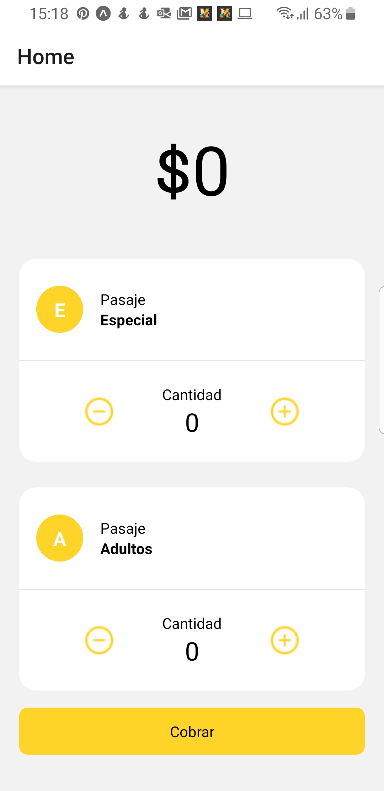

# App Collector

Para acceder a esta aplicación las cooperativas se registrarán en Transporte Pago para agregar a sus controladores o ayudantes, los cuales se se encargan de cobrar pasajes. Así los asistentes no tendrán que manipular monedas o dinero que posiblemente estén contaminados por el virus, así reducimos la probabilidad de contagio al realizar su trabajo.

El controlador por medio de la aplicación podrá: Registra la ubicación al leer el código QR del pasajero cuando se embarca en el transporte. Realiza el débito a los usuarios por pasaje.

## ¿Qué contiene el demo?

El demo te brinda la experiencia desde el punto de vista de un controlador de transporte que ya ha sido registrado y puede realizar cobros de pasajes escaneando un código Qr.

El siguiente código Qr pertece a un usuario de prueba, con el que puedes probrar la aplicación. Sin embargo, recomendamos que pruebes la aplicación de usuario desde [aquí](https://github.com/initgrammers/AppPassenger)

## ¿Cómo Probar?

Para probar debes tener un celular Android

### Opción 1:

- Descarga el apk [aquí](https://expo.io/artifacts/3630f861-a36c-462b-a71e-ba2a15ad7647)
- Instala el apk, si te pregunta

### Opción 2:

- Descarga expo-client [aquí](https://play.google.com/store/apps/details?id=host.exp.exponent)
- Escanea el código QR de la aplicación [aquí](https://expo.io/@henrymvc/AppCollector)

### Opción 3:

Esta opción es Avanzada y te permitirá probar todo el código por ti mismo

- Require Expo 3
- clona este repositorio

* `yarn install || npm install` para instalar las depencias.
* `expo start` para el entorno de desarrollo.
* Expo-client para poder probar en un emulador o en un telefono.

## Licencia

MIT
